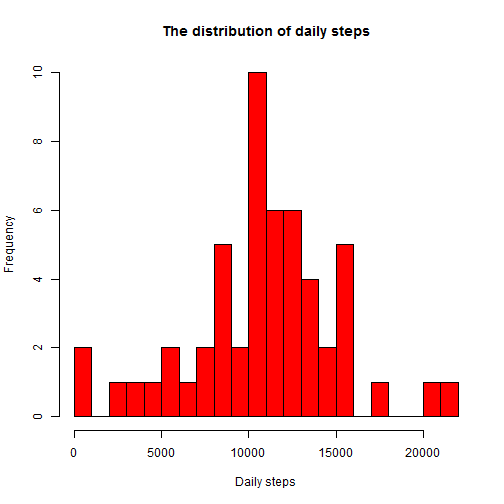
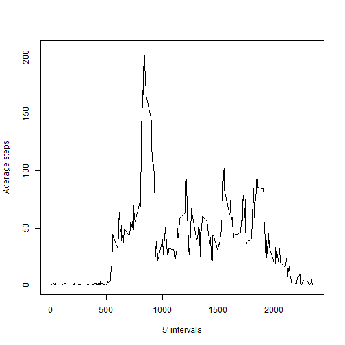
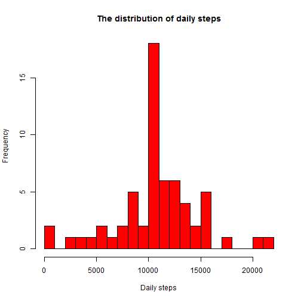
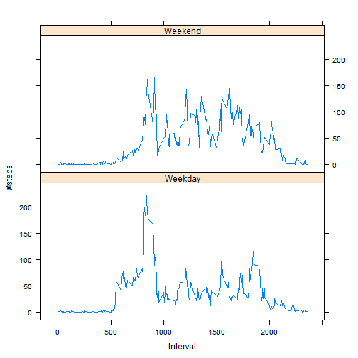

# Reproducible Research: Peer Assessment 1

## Loading and preprocessing the data

### Unzip if necessary

```r
if (!file.exists("activity.csv"))
{
unzip("activity.zip")
}
```
### Load the data

```r
activity<-read.csv("activity.csv", head=TRUE)
head(activity)
```

```
##   steps       date interval
## 1    NA 2012-10-01        0
## 2    NA 2012-10-01        5
## 3    NA 2012-10-01       10
## 4    NA 2012-10-01       15
## 5    NA 2012-10-01       20
## 6    NA 2012-10-01       25
```
### Little bit of prepping

```r
activity.prepped<-activity
activity.prepped$date<-as.Date(activity.prepped$date)
activity.prepped<-subset(activity.prepped, !is.na(activity.prepped$steps))
head(activity.prepped)
```

```
##     steps       date interval
## 289     0 2012-10-02        0
## 290     0 2012-10-02        5
## 291     0 2012-10-02       10
## 292     0 2012-10-02       15
## 293     0 2012-10-02       20
## 294     0 2012-10-02       25
```
### Sum steps by day

```r
activity.prepped.sum.by.date <- aggregate(list(steps = activity.prepped$steps), 
                                by=list(date=activity.prepped$date), FUN=sum)
head(activity.prepped.sum.by.date)
```

```
##         date steps
## 1 2012-10-02   126
## 2 2012-10-03 11352
## 3 2012-10-04 12116
## 4 2012-10-05 13294
## 5 2012-10-06 15420
## 6 2012-10-07 11015
```

## What is mean total number of steps taken per day?

### Create histogram

```r
hist(x=activity.prepped.sum.by.date$steps ,col="red",breaks=25,xlab="Daily steps",
     ylab="Frequency",
     main="The distribution of daily steps")
```


### Calculate mean and median

```r
mean_steps<-as.integer(mean(activity.prepped.sum.by.date$steps))

median_steps<-as.integer(median(activity.prepped.sum.by.date$steps))
```
Mean = 10766 
Median = 10765 

## What is the average daily activity pattern?
### Mean steps by interval

```r
activity.prepped.sum.by.interval <- aggregate(list(steps = activity.prepped$steps),   by=list(interval=activity.prepped$interval), FUN=mean)
head(activity.prepped.sum.by.interval)
```

```
##   interval     steps
## 1        0 1.7169811
## 2        5 0.3396226
## 3       10 0.1320755
## 4       15 0.1509434
## 5       20 0.0754717
## 6       25 2.0943396
```
### Create the plot 

```r
plot(activity.prepped.sum.by.interval$interval, 
     activity.prepped.sum.by.interval$steps, type="l",
     xlab="5' intervals", ylab="Average steps")
```


### Which interval has max number of steps

```r
max_steps<-max(activity.prepped.sum.by.interval$steps)
max_interval <- activity.prepped.sum.by.interval[activity.prepped.sum.by.interval$steps==max_steps,]
max_interval
```

```
##     interval    steps
## 104      835 206.1698
```
## Imputing missing values

```r
Number_of_NAs <- nrow(subset(activity, is.na(activity$steps)))
Number_of_NAs
```

```
## [1] 2304
```

```r
activity.impute <- activity
activity.impute.na <- is.na(activity.impute$steps)
activity.impute.sum.by.interval <- tapply(activity.prepped$steps, activity.prepped$interval, mean, na.rm=TRUE, simplify=T)
activity.impute$steps[activity.impute.na]<-activity.impute.sum.by.interval[as.character(activity.impute$interval[activity.impute.na])]
```
### Create histogram

```r
activity.impute.sum.by.date <- aggregate(list(steps = activity.impute$steps), by=list(date=activity.impute$date), FUN=sum)

hist(x=activity.impute.sum.by.date$steps ,col="red",breaks=25,xlab="Daily steps",
     ylab="Frequency",
     main="The distribution of daily steps")
```


### Calculate mean and median

```r
new_mean_steps<-as.integer(mean(activity.impute.sum.by.date$steps))
new_median_steps<-as.integer(median(activity.impute.sum.by.date$steps))
```
Mean = 10766 
Median = 10766 

So mean is unchanged, median has small change.  
Looks like imputing causes higher frequency counts in the middle.


## Are there differences in activity patterns between weekdays and weekends?

### Add variable day and weekendindicator 

```r
Sys.setlocale("LC_TIME", "English")
```

```
## [1] "English_United States.1252"
```

```r
activity.impute$weekday<-weekdays(as.Date(activity.impute$date))
activity.impute$weekendind<-ifelse(activity.impute$weekday=="Saturday" |activity.impute$weekday=="Sunday", "Weekend", "Weekday") 
```
### Mean steps by weekendind/interval

```r
activity.impute.wk <- aggregate(steps ~ weekendind+interval, data=activity.impute, FUN=mean)
head(activity.impute.wk)
```

```
##   weekendind interval      steps
## 1    Weekday        0 2.25115304
## 2    Weekend        0 0.21462264
## 3    Weekday        5 0.44528302
## 4    Weekend        5 0.04245283
## 5    Weekday       10 0.17316562
## 6    Weekend       10 0.01650943
```

### Create the plot 

```r
library(lattice)
xyplot(steps ~ interval | factor(weekendind),
       layout = c(1, 2),
       xlab="Interval",
       ylab="#steps",
       type="l",
       lty=1,
       data=activity.impute.wk)
```


  
Seems like people tend to wake up earlier weekdays but move more in the weekend.


